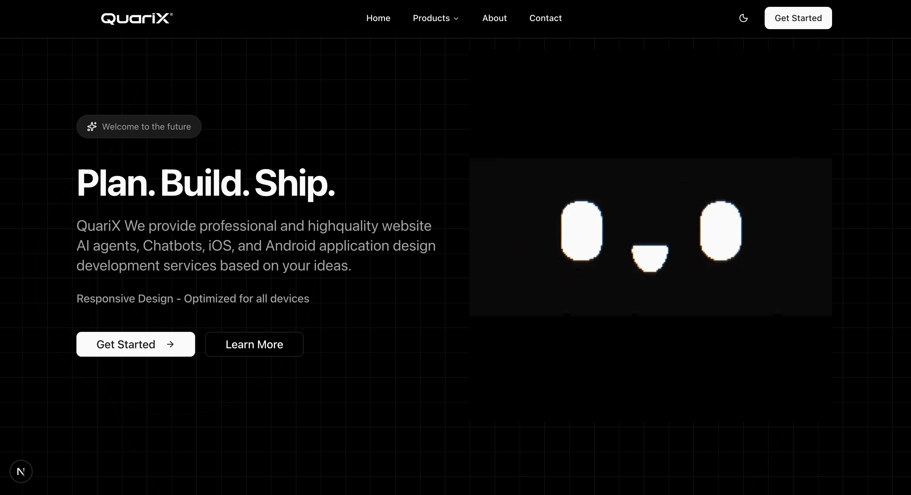

# QuariX

QuariX - Builds intelligent AI agents, chatbots, and custom web & mobile applications for modern businesses.

A modern web application built with Next.js, TypeScript, and Tailwind CSS.

## Screenshot



*Dark-themed landing page with modern design, featuring a hero section with "Plan. Build. Ship." headline and responsive layout.*

## Getting Started

First, install the dependencies:

```bash
npm install
```

Then, run the development server:

```bash
npm run dev
```

Open [http://localhost:3000](http://localhost:3000) with your browser to see the result.

## Project Structure

```
QuariX/
├── app/              # Next.js App Router directory
│   ├── layout.tsx    # Root layout component
│   ├── page.tsx      # Home page
│   └── globals.css   # Global styles with Tailwind CSS
├── public/           # Static assets
├── next.config.ts    # Next.js configuration
├── tailwind.config.ts # Tailwind CSS configuration
├── tsconfig.json     # TypeScript configuration
└── package.json      # Project dependencies and scripts
```

## Available Scripts

- `npm run dev` - Start the development server
- `npm run build` - Build the application for production
- `npm run start` - Start the production server
- `npm run lint` - Run ESLint to check for code issues

## Technologies Used

- **Next.js 15** - React framework for production
- **React 19** - UI library
- **TypeScript** - Type-safe JavaScript
- **Tailwind CSS** - Utility-first CSS framework
- **ESLint** - Code linting

## Contributors

- [@Gokulakrishnxn](https://github.com/Gokulakrishnxn)
- [@claude](https://github.com/claude)

## Learn More

To learn more about Next.js, take a look at the following resources:

- [Next.js Documentation](https://nextjs.org/docs)
- [Learn Next.js](https://nextjs.org/learn)
- [Next.js GitHub repository](https://github.com/vercel/next.js)
